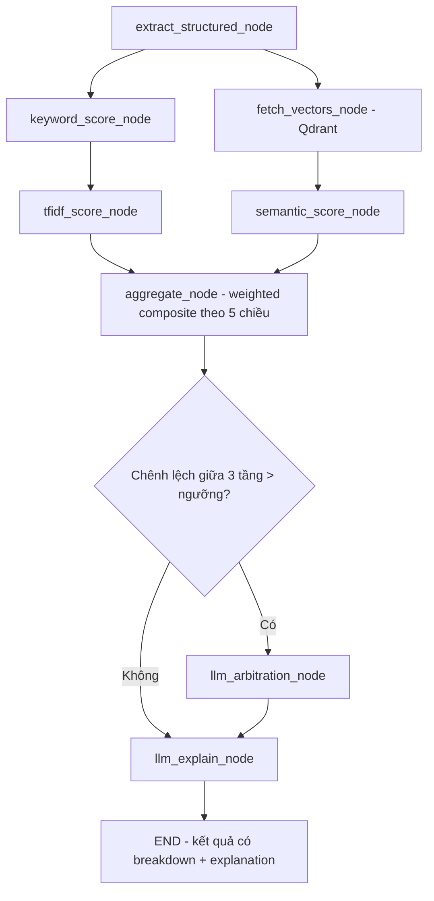

# Đề xuất nâng cấp AI Matching Engine: từ "Tự động hóa quy trình" sang "AI thông minh"

**Phạm vi:** Agent 2 (CV–JD Matching) và các thành phần liên quan trong `ai-service`, `recruitment-be/src/modules/matching`, `recruitment-be/src/modules/recruiter-applications`, `packages/shared`.

**Căn cứ đối chiếu:** Kahar T. et al., *"AI-Powered Resume Screening for HR Departments: An Intelligent Approach to Automated Candidate Evaluation, Skill Extraction, Job Matching, and Ranking"*, IJCSE Vol.14(5), 2026, DOI: 10.26438/ijcse.v14i5.7424. (Gọi tắt là **[Paper]** trong tài liệu này.)

---

## 1. Vấn đề GVHD đặt ra

Hệ thống hiện tại **tự động hóa** được luồng chấm điểm — ứng viên nộp CV → job được enqueue → gọi AI service → lưu điểm → recruiter xem danh sách sắp xếp theo điểm — nhưng **"trí tuệ" (intelligence)** của việc chấm điểm gần như không tồn tại theo đúng nghĩa học thuật: toàn bộ điểm số kỹ năng/kinh nghiệm/học vấn hiện do **một lệnh gọi LLM duy nhất phán đoán trên văn bản thô**, không có thuật toán tính toán được, không giải thích được bằng số liệu trung gian, và dữ liệu embedding ngữ nghĩa đã tính sẵn (Qdrant) **lại không được dùng vào công thức điểm**. Đây chính là khoảng cách giữa "automation" (tự động hoá một quy trình thủ công) và "intelligence" (hệ thống thực sự suy luận/so khớp bằng nhiều kỹ thuật AI bổ trợ nhau) mà [Paper] đặt làm trọng tâm thiết kế.

Tài liệu này: (1) đối chiếu kiến trúc hiện tại với khung lý thuyết của [Paper], (2) chỉ rõ từng khoảng trống bằng vị trí code cụ thể, (3) đề xuất kiến trúc matching đa tầng bám sát [Paper] nhưng khả thi trong hạ tầng LangGraph + Qdrant + NestJS đã có, và (4) đưa ra lộ trình triển khai theo sprint.

---

## 2. Khung lý thuyết của [Paper] (tóm tắt để đối chiếu)

[Paper] định nghĩa một "AI Matching Engine" thông minh gồm 3 tầng kỹ thuật kết hợp (§3.5), không dùng riêng lẻ:

1. **Keyword matching**: `Skill Score = Matched Skills ÷ Total Required Skills` — so khớp trực tiếp trên tập kỹ năng đã trích xuất có cấu trúc.
2. **TF-IDF cosine similarity**: `(A·B) / (‖A‖ × ‖B‖)` trên vector tần suất từ.
3. **Semantic embedding similarity**: dùng Sentence-Transformers/embedding để nhận diện tương đồng khái niệm giữa các cách diễn đạt khác nhau (vd. "xây dựng REST API" ≈ "phát triển backend").

Ba tầng trên hội tụ thành **5 chiều điểm trọng số** (§3.6, Table 3): Skill 50%, Experience 20%, Education 10%, Certifications 10%, Project relevance 10% — trọng số **có thể cấu hình theo từng vị trí tuyển dụng**. Kết quả cuối là một composite score **tính được, truy vết được** (traceable), phục vụ giải trình quyết định sàng lọc — khác với một con số do mô hình ngôn ngữ "đoán" ra mà không ai tái tạo lại được.

---

## 3. Hiện trạng hệ thống — đối chiếu từng điểm

| Tiêu chí theo [Paper] | Hiện trạng dự án | Vị trí code |
|---|---|---|
| Keyword matching (Matched/Total skills) | **Không có.** `parsedSkills` và `requiredSkills` đã tồn tại dạng mảng có cấu trúc trong DB nhưng bị nối thành văn bản thô rồi đưa nguyên vào prompt LLM | `matching.processor.ts` (`buildCvText`, `buildJobText`) |
| TF-IDF cosine similarity | **Không có.** Không có bước tính TF-IDF nào trong pipeline | — |
| Semantic embedding similarity | **Có tính nhưng không dùng vào điểm.** Qdrant lưu embedding CV/Job (OpenAI `text-embedding-3-small`), cosine similarity được tính (`_cosine_similarity`) nhưng chỉ đưa vào prompt làm "gợi ý" cho LLM, **không cộng vào `overall_score`** | `ai-service/app/agents/agent2_matching/graph.py` (`fetch_vectors_node`, dòng 65-75, 96-101) |
| 5 chiều điểm có trọng số, cấu hình theo vị trí | Chỉ có **3 chiều** (skills/experience/education), trọng số hardcode **trùng lặp ở 2 nơi** (TS + Python), không cấu hình theo job | `packages/shared/scoring.constants.ts` (dòng 58-62) và bản copy tay trong `graph.py` (dòng 11-13) |
| Điểm số tính toán được, giải thích được (explainable) | **Là black-box.** `skills_score`, `experience_score`, `education_score` do LLM tự phán đoán trực tiếp trên văn bản thô, không có công thức nào tái lập lại được các con số này | `graph.py` → `score_node` (dòng 78-112), schema `MatchAnalysis` |
| Trích xuất kỹ năng có cấu trúc (NER/dictionary) | Không có bước trích xuất riêng cho matching — Agent 1 đã trích xuất `parsedSkills` khi parse CV, nhưng Agent 2 không tái sử dụng có cấu trúc, chỉ dùng lại dạng text | `ai-service/app/agents/agent1_resume_parser/graph.py` |
| Ranking module | Đúng như [Paper] mô tả: **sort theo composite score đã lưu** — không tính lại | `recruiter-applications.service.ts` (dòng 137-142) |
| Semantic search / gợi ý việc làm tương tự | **Đã xây xong nhưng chưa dùng ở đâu.** Endpoint `GET /similar-jobs/{profile_id}` chạy Qdrant ANN search hoạt động tốt nhưng không có caller nào trong BE/FE | `ai-service/app/agents/agent2_matching/router.py` (dòng 124-138) |

**Kết luận hiện trạng:** hệ thống có đủ hạ tầng "thông minh" (LangGraph, Qdrant, embedding pipeline, dữ liệu có cấu trúc từ Agent 1) nhưng **không kết hợp chúng lại** — matching hiện tại tương đương một lệnh gọi ChatGPT duy nhất được bọc trong hàng đợi, đúng là "tự động hóa" chứ chưa phải kiến trúc AI đa kỹ thuật như [Paper] đề xuất.

---

## 4. Kiến trúc đề xuất: Matching Engine đa tầng

### 4.1 Nguyên tắc thiết kế

1. **Không bỏ LLM — đổi vai trò của nó.** LLM hiện đang đóng vai "người chấm điểm" (không giải thích được). Đề xuất chuyển LLM sang vai **"người giải thích + trọng tài cho trường hợp biên"**: sinh `explanation` bằng ngôn ngữ tự nhiên từ các điểm số *đã tính toán xong*, và chỉ can thiệp điều chỉnh khi 3 tầng điểm (keyword/TF-IDF/semantic) lệch nhau đáng kể (ví dụ ứng viên chuyển ngành, CV trình bày phi truyền thống).
2. **Tận dụng dữ liệu có cấu trúc đã tồn tại** (`parsedSkills`, `parsedExperience`, `parsedEducation`, `requiredSkills`) thay vì nối thành văn bản thô.
3. **Dùng lại embedding Qdrant đã tính** — hiện đang bị "bỏ phí", chỉ cần đưa `qdrant_similarity` (và điểm tương đồng theo từng kỹ năng) vào công thức trọng số thay vì chỉ hiển thị.
4. **Mỗi điểm thành phần phải tính lại được từ dữ liệu đầu vào** — yêu cầu bắt buộc để đáp ứng tiêu chí "explainable" mà GVHD/kiểm định sẽ hỏi.

### 4.2 Sơ đồ luồng LangGraph đề xuất (thay thế graph 2 node hiện tại)



| Node | Thay thế/bổ sung cho | Kỹ thuật | Đầu ra |
|---|---|---|---|
| `extract_structured_node` | (mới) | Đọc trực tiếp `parsedSkills`, `parsedExperience`, `parsedEducation`, `parsedCertifications`, `parsedProjects` từ Agent 1 thay vì nối text thô | Structured `CandidateProfile` / `JobRequirement` |
| `keyword_score_node` | (mới) | `Matched Skills ÷ Total Required Skills` — công thức §3.5 của [Paper], áp dụng chuẩn hoá (lowercase, alias skill: "ReactJS" = "React") | `skill_keyword_score` |
| `fetch_vectors_node` | Giữ nguyên từ hiện tại | Qdrant cosine similarity CV↔Job | `qdrant_similarity` (đổi tên `semantic_doc_score`) |
| `tfidf_score_node` | (mới) | `scikit-learn TfidfVectorizer` + cosine similarity trên `cv_text`/`job_text` — nhẹ, xác định, không tốn API call | `tfidf_score` |
| `semantic_score_node` | (mới, tách từ fetch_vectors) | Kết hợp `semantic_doc_score` (toàn văn) và tùy chọn per-skill embedding similarity (encode từng skill của JD, tìm skill CV gần nhất) | `semantic_score` |
| `aggregate_node` | Thay `score_node` phần cộng điểm | Công thức trọng số 5 chiều (xem §5) — thuần toán học, không gọi LLM | `overall_score`, `criteria breakdown` |
| `llm_arbitration_node` | (mới, có điều kiện) | Chỉ chạy khi 3 tầng lệch nhau > ngưỡng (vd. keyword thấp nhưng semantic cao → có thể đổi vocabulary) — LLM xem xét và có thể điều chỉnh nhẹ trong biên độ giới hạn | `adjustment`, `reasoning` |
| `llm_explain_node` | Thay phần `explanation` của `score_node` | LLM sinh giải thích tiếng Việt **từ các điểm đã tính**, không tự bịa số | `explanation` |

### 4.3 Vì sao đây là "thông minh" chứ không chỉ "tự động"

- **Đa kỹ thuật bổ trợ** đúng theo [Paper] §3.5: một kỹ năng bị bỏ sót bởi keyword matching (do khác từ vựng) vẫn có thể được bắt bởi semantic embedding — giảm false negative mà chính [Paper] §4.2 nhấn mạnh là lợi ích cốt lõi của semantic layer.
- **Explainable theo thiết kế**, không phải theo lời LLM tự thuật lại: mỗi request trả về breakdown `{skill: {keyword: 0.7, tfidf: 0.62, semantic: 0.81}, experience: ..., ...}` — recruiter và hội đồng có thể kiểm tra ngược.
- **LLM được dùng đúng chỗ nó mạnh** (xử lý ngôn ngữ tự nhiên, lý giải, xử lý trường hợp biên) thay vì đóng vai một calculator không minh bạch.

---

## 5. Công thức chấm điểm mới (5 chiều, có trọng số cấu hình)

Theo đúng mô hình Table 3 của [Paper], áp dụng vào dữ liệu đã có trong hệ thống:

| Chiều | Trọng số mặc định | Cách tính trong dự án | Nguồn dữ liệu |
|---|---|---|---|
| Skill match | 50% | `0.3×keyword + 0.3×tfidf + 0.4×semantic` (skill là chiều quan trọng nhất nên cần cả 3 tầng) | `parsedSkills` ↔ `requiredSkills`, `cv_text` ↔ `job_text` |
| Experience | 20% | So sánh số năm kinh nghiệm parse được với `job.experienceYears` (deterministic, không cần LLM) | `parsedExperience` |
| Education | 10% | Ánh xạ bậc học (Cao đẳng/ĐH/ThS...) sang thang điểm, so với yêu cầu job | `parsedEducation` |
| **Certifications** (mới) | 10% | Overlap chứng chỉ liên quan (keyword + semantic nhẹ) | `parsedCertifications` (cần bổ sung field nếu Agent 1 chưa trích) |
| **Project relevance** (mới) | 10% | Semantic similarity giữa mô tả dự án ứng viên và trách nhiệm công việc (`job.responsibilities`) | `parsedProjects` |

```
overall_score = Σ (weight_i × dimension_score_i)
```

**Cấu hình theo vị trí:** thêm cột `scoringWeights JSONB` (nullable) vào entity `Job` — nếu null thì dùng `MATCHING_WEIGHTS` mặc định. Điều này hiện thực hoá đúng yêu cầu "trọng số cấu hình theo từng role" của [Paper] §3.6, đồng thời giải quyết luôn vấn đề trọng số bị hardcode trùng lặp ở 2 codebase (TS/Python) — nên coi **`packages/shared` là nguồn chân lý duy nhất**, và expose nó qua API cho ai-service đọc (thay vì Python tự chép tay hằng số), hoặc sinh file JSON dùng chung ở bước build.

**Ngưỡng phân loại** (`MATCH_BANDS`) giữ nguyên logic hiện có (`strong/good/partial/poor_match`), chỉ áp lên `overall_score` mới.

---

## 6. Explainability — định dạng đầu ra đề xuất

Thay `MatchAnalysis` hiện tại (chỉ có 3 số + 1 đoạn text) bằng:

```jsonc
{
  "overall_score": 85.5,
  "recommendation": "strong_match",
  "breakdown": {
    "skill":        { "score": 88, "weight": 0.5, "keyword": 70, "tfidf": 62, "semantic": 91 },
    "experience":   { "score": 80, "weight": 0.2, "candidate_years": 3, "required_years": 2 },
    "education":    { "score": 100, "weight": 0.1 },
    "certification":{ "score": 60, "weight": 0.1, "matched": ["AWS SAA"], "missing": ["PMP"] },
    "project":      { "score": 85, "weight": 0.1 }
  },
  "explanation": "…do LLM sinh từ breakdown ở trên…",
  "flags": []            // vd. "llm_arbitration_applied" nếu node arbitration có can thiệp
}
```

Đây chính là điểm khác biệt then chốt để chứng minh với GVHD: **điểm số tái lập được từ dữ liệu**, không phải một con số LLM "nói sao nghe vậy".

---

## 7. Cân nhắc Bias/Fairness (theo [Paper] §4.2, §6)

[Paper] nhấn mạnh: hệ thống chấm điểm tự động có thể **khuếch đại thiên kiến sẵn có** nếu trọng số/tiêu chí không được giám sát. Đề xuất bổ sung (không bắt buộc ngay, nhưng nên nêu trong đồ án như "future scope" đã dẫn nguồn từ [Paper] §6):

- Log breakdown điểm theo từng dimension cho mọi ứng viên đã chấm (đã có `MatchingResult.criteria` — chỉ cần đảm bảo lưu breakdown mới).
- Không dùng trực tiếp trường nhạy cảm (tên trường học, tên trường đại học "danh tiếng") làm feature ảnh hưởng semantic score.
- Threshold auto-reject (`AUTO_REJECT_THRESHOLD = 30`) nên đi kèm cơ chế review thủ công định kỳ mẫu ngẫu nhiên các hồ sơ bị auto-reject, để phát hiện false negative có hệ thống.

---

## 8. Lộ trình triển khai đề xuất

| Giai đoạn | Nội dung | Phụ thuộc |
|---|---|---|
| **P1** | `keyword_score_node` + `tfidf_score_node` (thuần toán học, không đổi hạ tầng) dùng `parsedSkills`/`requiredSkills` có sẵn | Không |
| **P2** | Sửa `aggregate_node`: đưa `qdrant_similarity` đã có sẵn vào công thức trọng số (khắc phục ngay điểm yếu lớn nhất — dữ liệu có sẵn nhưng bị bỏ phí) | P1 |
| **P3** | Thêm 2 chiều **Certification** và **Project relevance** — cần kiểm tra Agent 1 đã trích các field này chưa, bổ sung nếu thiếu | P1 |
| **P4** | Hợp nhất `MATCHING_WEIGHTS`: xoá bản copy tay trong Python, đọc từ `packages/shared` (hoặc sinh config JSON dùng chung); thêm `Job.scoringWeights` để cấu hình theo role | P1-P3 |
| **P5** | Đổi vai trò LLM: `llm_explain_node` sinh giải thích từ breakdown, `llm_arbitration_node` chỉ chạy có điều kiện | P1-P2 |
| **P6** (tuỳ chọn, điểm cộng) | Kết nối `similar-jobs` endpoint đã có sẵn vào FE — tính năng "gợi ý việc làm phù hợp" cho ứng viên, tận dụng luôn hạ tầng Qdrant hiện có | Độc lập |

P1–P2 mang lại tác động lớn nhất so với công sức bỏ ra: chỉ cần thêm 2 node tính toán và sửa công thức cộng điểm là đã chuyển được điểm số từ "1 con số LLM đoán" sang "composite score từ 3 kỹ thuật độc lập", đúng tinh thần cốt lõi của [Paper].

---

## 9. Tóm tắt so sánh trước/sau

| | Hiện tại | Sau đề xuất |
|---|---|---|
| Số kỹ thuật matching | 1 (LLM judgment) | 3 (keyword + TF-IDF + semantic embedding) |
| Số chiều điểm | 3 | 5 (đúng theo [Paper]) |
| Vai trò LLM | Chấm điểm trực tiếp (black-box) | Giải thích + trọng tài trường hợp biên |
| Dùng Qdrant embedding vào điểm? | Không | Có |
| Trọng số cấu hình theo job? | Không (hardcode, trùng lặp 2 nơi) | Có (`Job.scoringWeights`, nguồn chân lý duy nhất) |
| Truy vết/giải thích điểm số | Không thể tái lập | Breakdown từng chiều, tái lập được |
